# Лабораторная работа №2  
Структура проекта: 
```bash
lab2/
├── tasks/
│   └── main.yml                # Основной файл с задачами для плейбуков
├── templates/
│   └── Caddyfile.j2            # Шаблон конфигурации Caddy
├── caddy_deploy.yml            # Основной Плейбук для Caddy
├── task1.yml                   # Основной Плейбук для задания 1
├── task1-1.yml                 # Плейбук для создания txt
├── task1-2.yml                 # Плейбук для изменения txt
├── photos/                     # Скриншоты
README.md                   # Документация
```

## Часть №1 - Ход работы:  

### 1. Проверяем, что сервер с Ansible подключился к “localhost”  
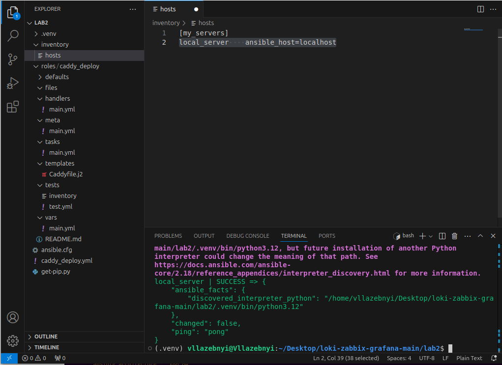  

---

### 2. Создаем текстовый файл с производным содержимым, через модуль shell 
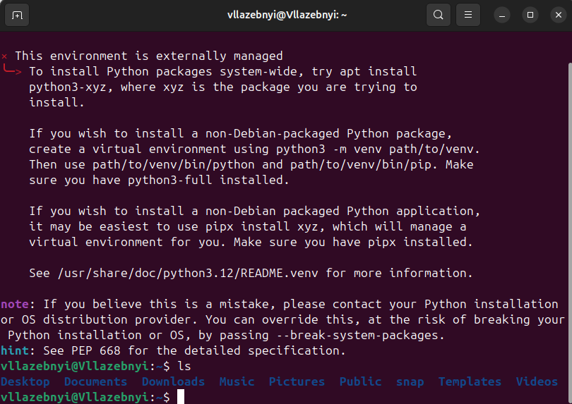   
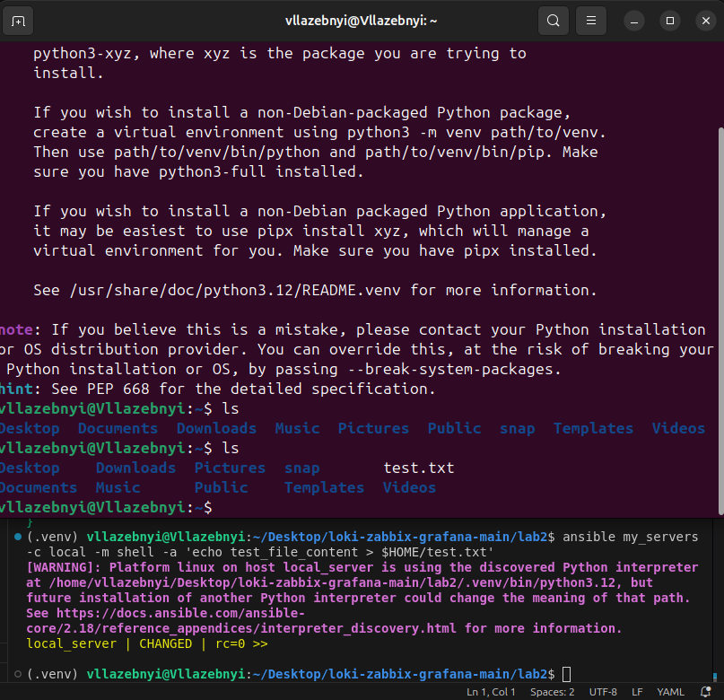  

---


### 3. Удаляем файл через модуль file:
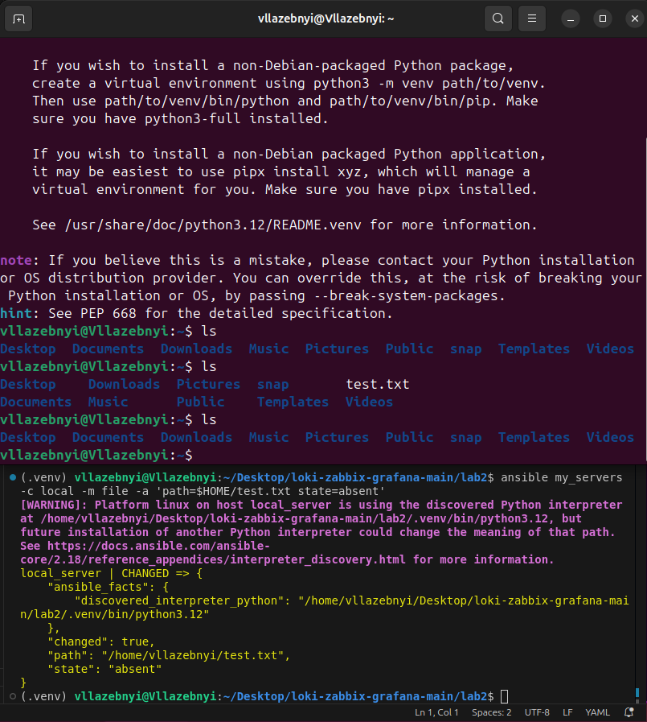

---
### 4. Запускаем плейбук  
Выполняем команду:  
```bash
ansible-playbook caddy_deploy.yml
```
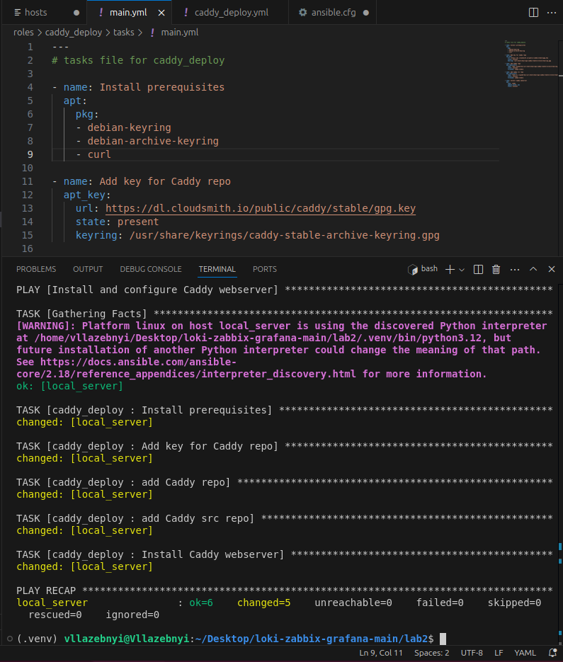

---
### 5. Создаём на duckdns.org домен и подключаем адресс, после чего настраиваем Caddyfile.j2 и main.yml
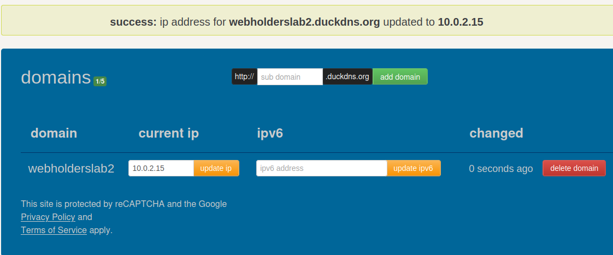
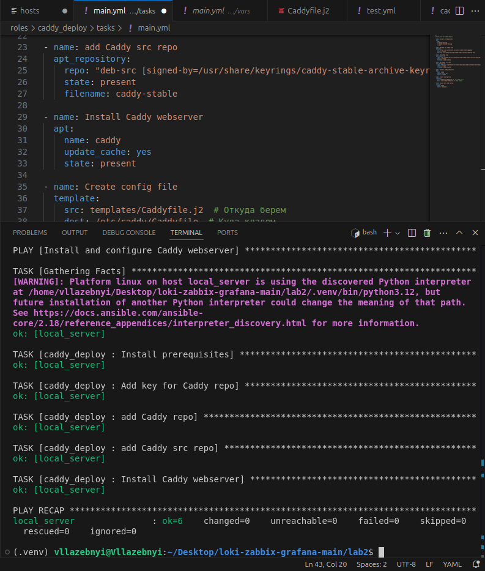
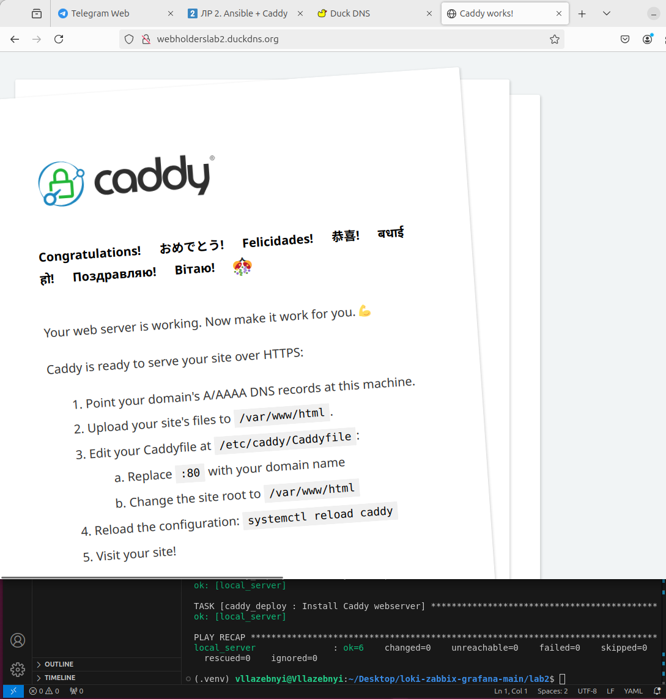

## Часть №2 - Выполнение заданий: 

### Задание 1: Переписать пример с созданием и удалением файла из шага 5 Части 1 с ad-hoc команд на плейбук формат, а так же добавить четвертый шаг - перед удалением поменять содержимое файла на любое другое. 

Создали плейбук `task1.yml` для работы с файлами. Запихали:
- Создание файла
- Изменение содержимого
- Удаление файла

для проверки разделил файл на отдельные части:
- `task1-1.yml` - Создание файла
- `task1-2.yml` - Проверка существования и Изменение содержимого

Пример Создания txt файла после запуска `task1-1.yml`:


Пример Проверки существования txt и Изменения его содержимого после запуска `task1-2.yml`:

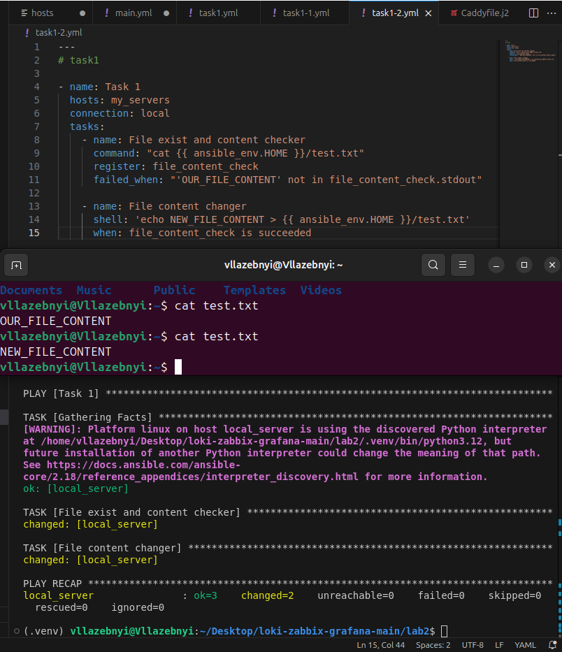

Пример Удаления txt файла после работы основного `task1.yml`:


### Задание 2: “Расширить” конфиг вебсервера Caddy любым функционалом по желанию: например, добавить проксирование, или какие-нибудь заголовки (header). Вместо дефолтной страницы Caddy подставить свою, хотя бы index.html с Hello world внутри. Добавить это в качестве дополнительного шага в tasks.

#### Обновленная конфигурация Caddy `templates/Caddyfile.j2`:
```
:80 {
root * /var/www/html
    file_server

    log {
        output file /var/log/caddy/access.log
        format json
        level {{ log.level }}
    }

    header / {
        X-Custom-Header "LR2"
    }
}
```

#### Добавили 2 новые задачи в `tasks/main.yml`:

- добавляем страницу

```yaml
- name: Create custom index.html
  copy:
    content: |
      <html>
      <head>
        <title>LR2</title>
      </head>
      <body>
        <h1>HELLO FROM WEB_HOLDERS</h1>
        
      </body>
      </html>
    dest: /var/www/html/index.html
```

- подгружаем gif rickroll, чтобы зарикроллить вас 😉

```yaml
- name: Upload rickroll.gif to local server
  copy:
    src: ./templates/rickroll.gif
    dest: /var/www/html/rickroll.gif
```

- Получаем заголовок и новую страницу

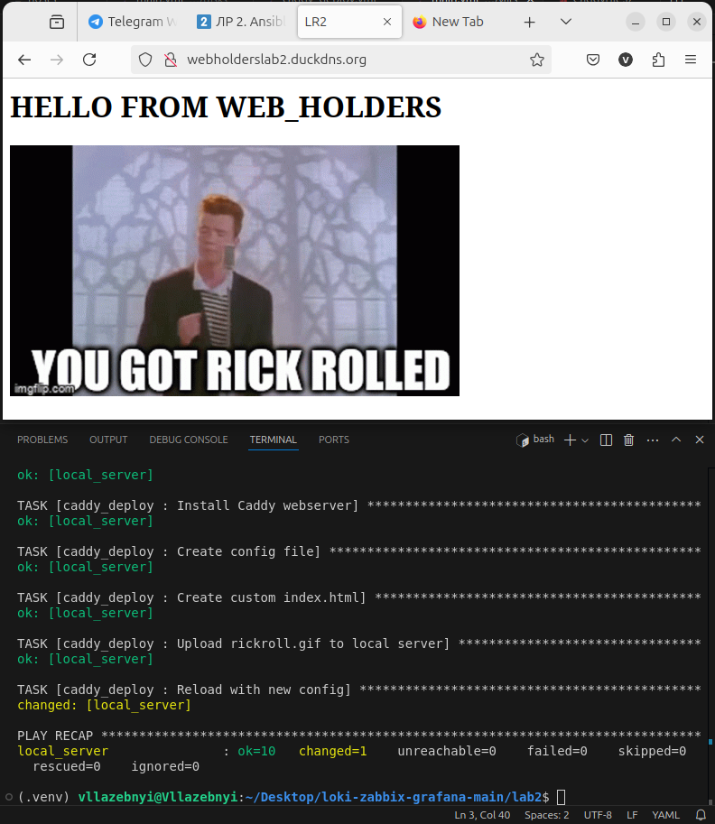

- Проверяем статус

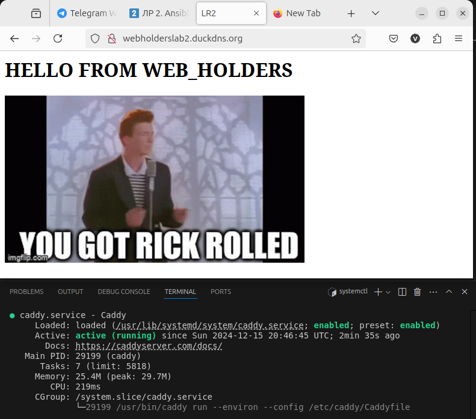

## Заключение

Все поставленные задачи выполнены успешно. Настроен веб-сервер Caddy с кастомной конфигурацией и собственной стартовой страницей. Разработаны плейбуки для автоматизации различных задач.

_Отчет подготовлен студентом команды Web_holders_

## Дополнительные комментарии к заданиям:  

1. **Выполнение на макбуке:**  
   Я не представляю как студенты выполняли задачи на mac os, Система не может подгрузить модули не на Debian систему.

2. **Модули:**  
   Некоторые модули в файле `tasks/main.yml` требуют root прав, что решил путем добавления в `caddy_deploy.yml`
   ```yaml
   become: yes
   ```

3. **Пойду трогать траву 🪴**

